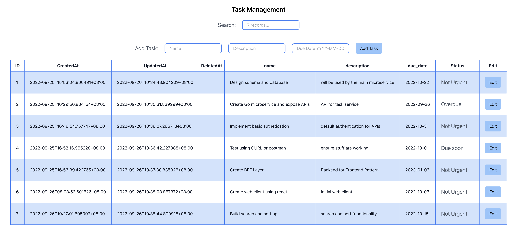
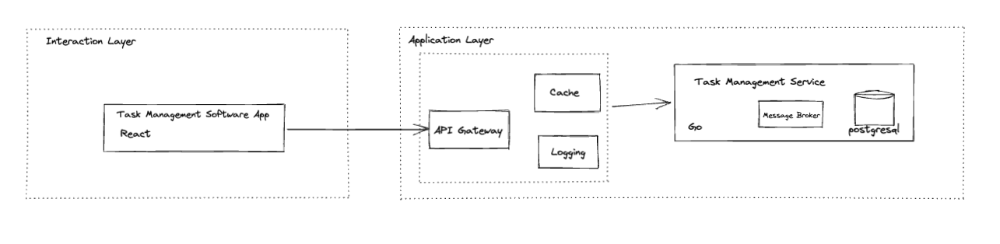
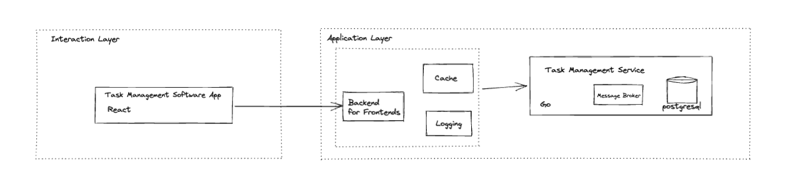

# Tech Spec

| Epic | link to jira |
| --- | --- |
| Spec Writer | Ren |
| Reviewer | James, Welly, Software engineer |
| Code Writer | Ren |
| QA |  |

## Steps to Run Locally:

1. Create local database with name **`checkbox_ai_task_db`** 
    1. **`docker run --name <YOUR CONTAINER NAME> -p 5455:5432 -e POSTGRES_USER=<YOUR POSTGRES USER> -e POSTGRES_PASSWORD=<YOUR POSTGRES PASSWORD> -e POSTGRES_DB=checkbox_ai_task_db -d postgres`**
2. copy the `.env.example` under `/server` and `/microservice` to their own `.env` file respectively
3. inside `/microservice` run `make server`
4. inside `/server` run `nodemon`
5. inside `/client` run `npm run start`
6. install CORS chrome extension

## Overview

I’ve been assigned to a team working on building out a new task management software 

## Goals

- User should be able to create a new task, including the following fields (Required)
    - Name
    - Description
    - Due date
- User should be able to view all tasks created in a list view, showing all the following
details (Required)
    - Name
    - Description
    - Due date
    - Create date
    - Status
        - Not urgent
        - Due soon (Due date is within 7 days)
        - Overdue
- User should be able to edit task name, description and due date (Required)
- User should be able to sort by due date or create date (Should have)
- User should be able to search based on task name (Should have)

## Stakeholders

| Stakeholder | How | Comments |
| --- | --- | --- |
| James | Reviews the take home exam | Manage expectations on delivery of take home exam |
| Welly | Reviews the take home exam | Manage expectations on delivery of take home exam |
| Checkbox.ai Software engineer | Reviews the take home exam | ??? |

## Acceptance Criteria

- Working solution with all the required items fulfilled
- Identify risks
- Any technology can be used, preference to use React, Go and Postgres
- Can use any library
- Don’t focus on the styling
- Create a list of further improvements to the code if given more time

## Risk/ Blockers/ Security Assessment

| Item | Notes |
| --- | --- |
| Scalability - Expected to receive large amount of volume for task creation requests | Microservice approach with API gateway / Backend for frontend pattern scales |
| CORS on local development | Don’t sweat it, there is chrome extension for this |
| Security - unauthorised access to API | Address in on the later time |

## Assumptions

- That we are using Microservice architecture.
- The client application and the backend code is owned by the same team.
- That we are only building one client application (Single Page Application SPA).
- That we are using Basic Authentication for this takehome exam.

## High level Flow, Service Diagram, Architecture

Option 1: API Gateway

Option 2: Backend For Frontends

Modern microservices systems favors use of API gateway/ A component which all communication between clients and the system flows. There is also the Backends For Frontend ( BFF) pattern which is a variation of API gateway.

### Goals of both:

- decoupling system or internal services from actual clients that use the system.
    - clients dont directly know location of the system service.
    - Have layer of abstraction so the client and server dont have dependency on communication protocols. GRPC, WSDL, REST, GraphQL
    - Clients need only to know the API gateway’s location, client is agnostic which internal system service is serving their request.
    - API gateway can centralize handling of
        - Authentication
        - Rate limiting

## Difference:

- API gateway is a single point of entry for all types of clients (mobile, single page application )
- BFF is only responsible for a single type of client

Things to consider:

| Question | Remark |
| --- | --- |
| How many clients? | Since requirement only have one client (React App) so leaning towards BFF |
| Are the clients owned by different team? | No, both client and backend is owned by the same team, leaning towards API gateway |
| Are we performing some form of aggregation on the API gateway. How likely the aggregation change for the clients | We only have one client planned for now so leaning towards BFF |
| What are the authentication mechanisms used by the client?  | Basic Authentication, leaning towards BFF |
| How would clients handle cross cutting concerns (authentication, rate limiting, data aggregation) | Since there is no clear requirement about this, leaning towards BFF |
| Requirement about the “Status” | I decided to handle it as presentation logic since the status is derived from the duedate. No point persist this data in the database. |

base on the considerations above, I’ll pick to use BFF Pattern. The moment we have a new request to have a different client in the future then we’ll assess how we can support it and decide if we will refactor to use an API Gateway

## Implementation Details

### Tasks

| # | Task | Status |
| --- | --- | --- |
| 1  | Create Database Schema | Done |
| 2 | Create Go Microservice and expose APIs  | Done |
| 3 | Implement Basic Authentication | Not Done |
| 4 | Test using Curl / Postman | Done |
| 5 | Create BFF layer | Done |
| 6 | Create base react client using react tables | Done |
| 7 | Build sorting | Done |
| 8 | Build search | Done |

### Microservice Layer

- Golang
- Viper for env variables
- Gin Web Framework

### Challenges

- usage time.Time caused some issues on binding so decided to keep it simple and handle due date as string instead of datetime.
- considered adding the status logic in the backend but its taking too much time of exploration.
- CORS on local development

### **Learnings**

- Its very easy to create API with golang.
- Need to be familiar setting up goroot.
- Makefile

### BFF Layer

- typescript
- express
- axios

### Challenges

- considered adding the status logic in the backend but its taking too much time of exploration.
- CORS on local development

### **Learnings**

- played around usage of chalk for custom logging.
- nodemon

### Interaction Layer

- React
- JS

### Challenges

- needed to brushup frontend knowledge. Not my strongest suite
- styling is taking too much time. Used tailwind css

### Learnings

- react-table is awesome. Alot of features directly supported and exposed alot of hooks. “Custom Cell”, Global Search - [https://react-tables.com/](https://react-tables.com/)
- refreshed react knowledge

## List of improvements

1. Development, since the ask is a simple one table api with a frontend, I didn’t focus much on unit testing. Given more time I’ll focus more on creating unit tests on area where it would make sense. (status logic, end to end tests)
2. UI/UX, Editable rows
3. UI/UX, Pagination including filtering
4. Development, Since the app I built involved 3 projects, better to containerize it so its easier to setup locally and can be managed with Kubernetes on deploying to prod/staging
5. Security, introduce JWT or atleast basic authentication for the API
6. Scaling, read write DB replica
7. Scaling, Event Driven Architecture

## In Summary

I enjoyed doing the takehome exam as I needed to roll sleeve and go back to hands on coding. I learned something new by doing this. Thanks for the opportunity.